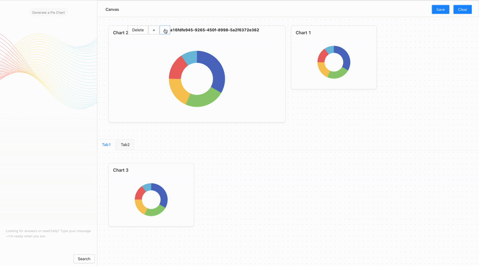

# 🧱 React Drag and Drop Grid
A flexible drag-and-drop grid system built with React and TypeScript.  
Supports multiple groups, resizable cards, and a responsive flow layout.

## ✨ Features
- **Multiple Groups**  
  Grouped cards with independent drag contexts.

- **Resizable Cards**  
  Dynamically adjust card sizes within the grid.

- **Flow Layout**  
  Automatically wraps and reflows cards based on available space.

## 🎬 Demo


## 🚀 Live Preview  
 🔗 [yizhu.github.io/drag-drop-grid](https://yizhu.github.io/drag-drop-grid)

## 🛠 Tech Stack
- React
- [react-dnd](https://react-dnd.github.io/react-dnd/about)
- TypeScript

## 📦 Getting Started
```bash
npm install
npm start
```

## 📄 License
This project is licensed for **personal and non-commercial use** only.  
If you would like to use it for commercial purposes, please reach out to: kyizhuguo@gmail.com